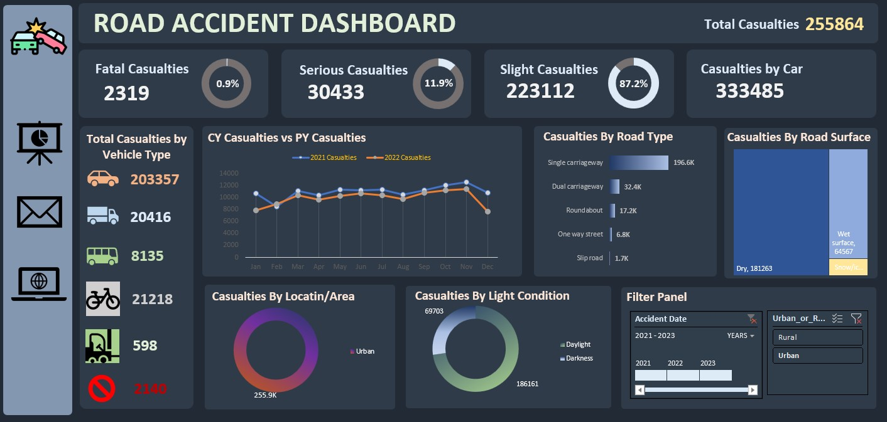

# 🚧 Road Accident Data Analysis


## 🎯 Objective

To analyze road accident data and identify key risk factors affecting accident severity and frequency.

---

## 🛠️ Tools Used

* Microsoft Excel
* Pivot Tables
* Charts & Graphs

---

## 📂 Dataset

The dataset includes:

* Vehicle type
* Road conditions
* Location details
* Casualty data

---

## 🔍 Project Workflow

* Data cleaning and formatting
* Created pivot tables for analysis
* Built charts to visualize trends
* Identified high-risk patterns

---

## 📈 Key Insights

* Certain vehicle types are involved in more accidents
* Poor road conditions increase accident severity
* Specific locations have higher casualty rates

---

## 📊 Dashboard Preview



---

## 🚀 Conclusion

This project highlights major accident risk factors and supports data-driven decision-making for improving road safety.

---

## 📁 Project Structure

```
Road-Accident-Analysis/
│── road_accident_data.xlsx
│── dashboard.png
│── README.md
```
